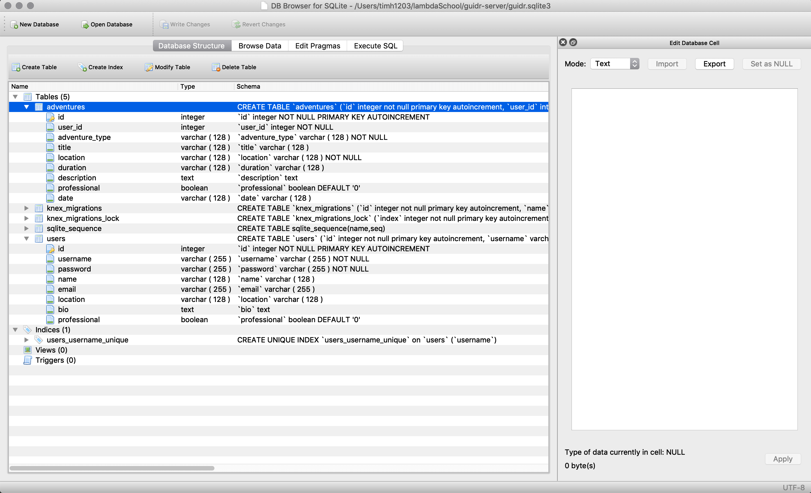
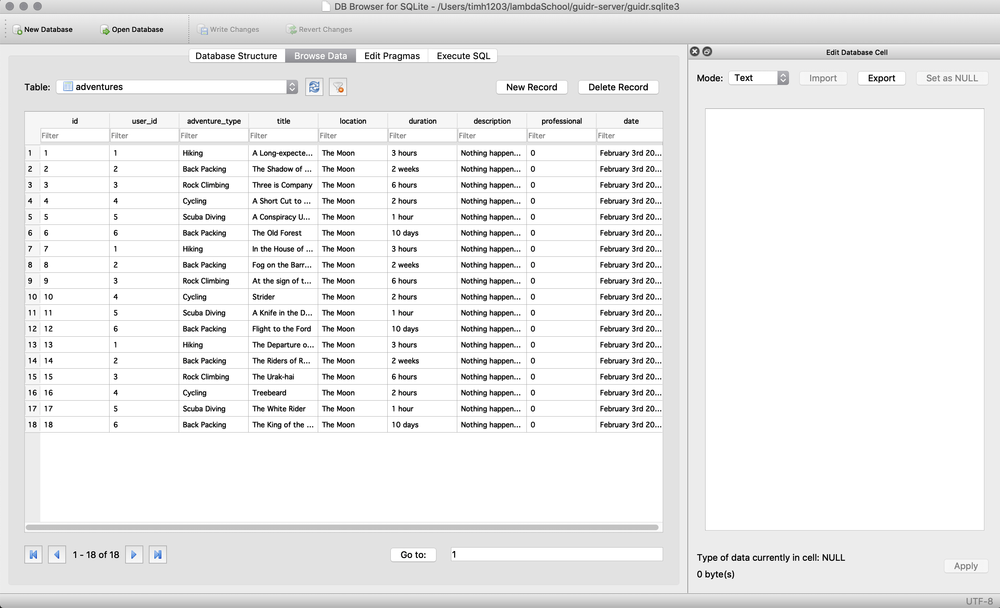
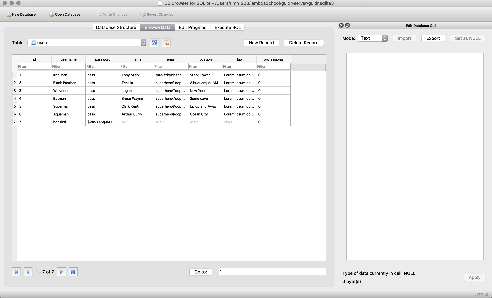

# Guidr App



## By The Guidr Team

- UI team: Steven Jefferson, James Goodnight, Itel Domingo
- Lead Frontend Developer: Matt Basile
- Lead Backend Developer: Asa Shalom
- Scrum Master: Timothy Hoang

## To utilize this app

- To view deployed app, visit: [Guidr Home](https://guidr2.netlify.com/)
- To hit endpoints of the app, target: [Guidr Heroku](https://guidr2.herokuapp.com)
- To get to the github repo of the app, target: [Github Server Repo](https://github.com/guidr-app-lion-team/guidr-server)

## About

- [Guidr](https://guidr2.netlify.com/) is an app that helps backcountry guides of all types log their private/professional trips.
- Sign up for an account, add adventures, see different profile
- Currently: Stable Version v1.0 -- updates are possible, not currently planned (as of 2/8/2019)

## Features

- A powerful back-end platform built with Node, Express, SQLite3, Knex, Axios, JSON Web Tokens, and Bcryptjs
- Ability to hit target endpoints to get specific data from MySQL server with adventures and user tables

## Technologies for this project

- [Node](https://nodejs.org/en/)
- [Express](https://expressjs.com/)
- [SQLite3](https://www.sqlite.org/index.html)
- [Axios](https://www.npmjs.com/package/axios)
- [Knex](https://knexjs.org/)
- [Bcryptjs](https://www.npmjs.com/package/bcryptjs)
- [CORS](https://www.npmjs.com/package/cors)
- [Dotenv](https://www.npmjs.com/package/dotenv)
- [Morgan](https://www.npmjs.com/package/morgan)
- [Helmet](https://www.npmjs.com/package/morgan)

## API Endpoints

- **Admin Routes**
- POST `https://guidr2.herokuapp.com/register` = Registers a user

- POST `https://guidr2.herokuapp.com/login` = Logs in a user
- requires user object with
```js
`username` (string),
`password` (string),
```

- GET `https://guidr2.herokuapp.com/adventures` = Authenticates a user
- not in use

- **Adventure Routes**

- POST `https://guidr2.herokuapp.com/adventures` = Adds a new adventure
- submit an object with the shape of:
```js
`id` (number),
`user_id` (number),
`adventure_type` (string),
`title` (string),
`location` (string),
`duration` (string),
`description` (string),
`professional` (boolean),
`date` (string),
```

- GET `https://guidr2.herokuapp.com/adventures` = Gets all the adventures
- returns an ARRAY of objects with shape of:
```js
`id` (number),
`user_id` (number),
`adventure_type` (string),
`title` (string),
`location` (string),
`duration` (string),
`description` (string),
`professional` (boolean),
`date` (string),
```

- GET `https://guidr2.herokuapp.com/adventures/:id` = Gets specific adventure by ID
- returns an object with shape of:
```js
`id` (number),
`user_id` (number),
`adventure_type` (string),
`title` (string),
`location` (string),
`duration` (string),
`description` (string),
`professional` (boolean),
`date` (string),
```

- PUT `https://guidr2.herokuapp.com/adventures/:id` = Updates a specific adventure by ID

- DELETE `https://guidr2.herokuapp.com/adventures/:id` = Deletes specific adventure by ID

- **User Routes**

- POST `https://guidr2.herokuapp.com/user` = Adds a new user

- GET `https://guidr2.herokuapp.com/user` = Gets all the users
- returns an ARRAY of objects with shape of:
```js
`id` (string),
`username` (string),
`name` (string),
`email` (string),
`location` (string),
`bio` (string),
`professional` (boolean)
```

- GET `https://guidr2.herokuapp.com/user/:id` = Gets specific user by ID
- returns specific user object with shape of:
```js
`id` (string),
`username` (string),
`name` (string),
`email` (string),
`location` (string),
`bio` (string),
`professional` (boolean)
```

- GET `https://guidr2.herokuapp.com/user/:id/adventures` = Gets all adventures from specific user by ID
- returns an ARRAY of objects with shape of:
```js
`id` (number),
`user_id` (number),
`adventure_type` (string),
`title` (string),
`location` (string),
`duration` (string),
`description` (string),
`professional` (boolean),
`date` (string),
```

- PUT `https://guidr2.herokuapp.com/user/:id` = Updates a specific user by ID

- DELETE `https://guidr2.herokuapp.com/user/:id` = Deletes specific user by ID

## To edit the source code

- Github Repo: [Guidr Server Repo](https://github.com/guidr-app-lion-team/guidr-server)
1. Have stable NPM and NodeJS versions installed on your computer
2. Navigate to the directory of choice and type `git clone https://github.com/guidr-app-lion-team/guidr-server.git`
3. Install necessary packages either with `npm install` or `yarn`
4. Run the client with `npm start` or `yarn start`, then navigate to `http://localhost:5000/` to see the client
5. Open up the codebase with your favorite editor and hack away!

## More pictures

### Database Structure


### Adventures Data



### Adventure Object


### Users Data


